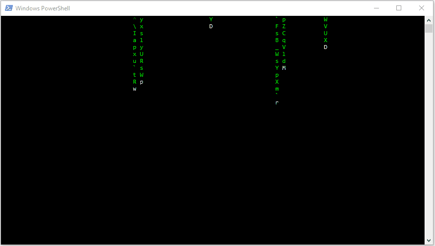

# cmatrix Effect

The matrix effect on Windows through `PowerShell`



## How to

1) Open `Windows Powershell` (in some cases Admin privilege might be needed)

2) Either download and save [cmatrix.psm1](https://raw.githubusercontent.com/matriex/cmatrix/master/cmatrix.psm1) or just clonethis repo using `git clone https://github.com/matriex/cmatrix`

3) Import the module, set the timeout and enable it:
````powershell
Set-Executionpolicy remotesigned
Import-Module .\cmatrix
Set-ScreenSaverTimeout -Seconds 5
Enable-ScreenSaver
````

If you are happy with it, then you can put it also in one of your module folders that you can get via `$env:PSModulePath`. Just create a folder named `cmatrix` and put `cmatrix.psm1` in it and then the next time you can just import it as `Import-Module cmatrix` without having to specify the full path.

_Author: Oisin Grehan_

_Contributor: Christoph Bergmeister_
